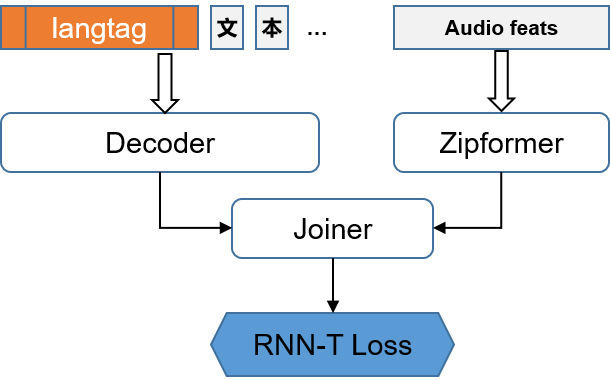

# Introduction

The PengChengStarling project is a multilingual ASR system development toolkit built upon [the icefall project](https://github.com/k2-fsa/icefall). Compared to the original icefall, it incorporates several task-specific optimizations for ASR. 
Firstly, we replaced the recipe-based approach with a more flexible design, decoupling parameter configurations from functional code. This allows a unified codebase to support ASR tasks across multiple languages. 
Secondly, we integrated language IDs into the RNN-Transducer architecture, significantly improving the performance of multilingual ASR systems.

To evaluate the capabilities of PengChengStarling, we developed a multilingual **streaming** ASR model supporting **eight** languages: Chinese, English, Russian, Vietnamese, Japanese, Thai, Indonesian, and Arabic. Each language was trained with approximately **2,000** hours of audio data, primarily sourced from open datasets. Our model achieves comparable or superior streaming ASR performance in **six** of these languages compared to Whisper-Large v3, while being only **20%** of its size. Additionally, our model offers a remarkable **7x** speed improvement in inference compared to Whisper-Large v3.

| Language | Testset | Whisper-Large v3 | Ours |
|:--------:|:-------:|:----------------:|:----:|
| Chinese | [wenetspeech test meeting](https://github.com/wenet-e2e/WenetSpeech) | 22.99 | **22.67** |
| Vietnamese | [gigaspeech2-vi test](https://huggingface.co/datasets/speechcolab/gigaspeech2) | 17.94 | **7.09** |
| Japanese | [reazonspeech test](https://huggingface.co/datasets/reazon-research/reazonspeech) | 16.3 | **13.34** |
| Thai | [gigaspeech2-th test](https://huggingface.co/datasets/speechcolab/gigaspeech2) | 20.44 | **17.39** |
| Indonesia | [gigaspeech2-id test](https://huggingface.co/datasets/speechcolab/gigaspeech2) | **20.03** | 20.54 |
| Arabic | [mgb2 test](https://arabicspeech.org/resources/mgb2) | 30.3 | **24.37** |

Our model checkpoint is open-sourced on [Hugging Face](https://huggingface.co/stdo/PengChengStarling) and provided in two formats: PyTorch state dict for fine-tuning and testing, and ONNX format for deployment.

# Installation

Please refer to the [document](https://icefall.readthedocs.io/en/latest/installation/index.html) for installation instructions. If the installation test is successful, PengChengStarling is ready for use.

# Training

## 1. Data Preparation

Before starting the training process, you must first preprocess the raw data into the required input format. Typically, this involves adapting the `make_*_list` method in `zipformer/prepare.py` to your dataset to generate the `data.list` file. 
The subsequent steps are applicable to all datasets. Once completed, the script will produce the corresponding cuts and fbank features for each dataset, which serve as the input data for PengChengStarling. 
The script’s parameters are configured through YAML files located in the `config_data` directory. Once you’ve prepared the YAML file for your dataset, you can run the script using the following command:

```bash
export CUDA_VISIBLE_DEVICES="0"

python zipformer/prepare.py --config-file config_data/<your_dataset_config>.yaml
```

For more details about cut, please refer to the [document](https://lhotse.readthedocs.io/en/latest/cuts.html).

## 2. BPE Training

A multilingual ASR model must be capable of generating transcriptions in multiple languages. To achieve this, the BPE model should be trained on text data from various languages. Since transcriptions are embedded in cuts, you can use the training cuts from all the target languages to train the BPE model.

The script to train the BPE model is located in `zipformer/prepare_bpe.py`. To run the script, you need to first configure the parameters in a YAML file and place it in the `config_bpe` directory. Please note that the langtags parameter should cover all target languages. For non-space-delimited languages such as Chinese, Japanese, and Thai, word segmentation should be performed before BPE training to assist the process. Once the YAML file for your BPE model is prepared, you can run the script with the following command:
```bash
python zipformer/prepare_bpe.py --config-file config_bpe/<your_bpe_config>.yaml
```

## 3. Model Training and Finetuning
We adopt a Transducer architecture with Zipformer as the Encoder for our multilingual ASR model. To mitigate cross-linguistic interference issues, we explicitly specify the target language by replacing the `<SOS>` token with a corresponding `<langtag>` in the Decoder. 

<div style="width:40%">
  
</div>

The script for training the multilingual ASR model is located in `zipformer/train.py`. Before running the script, you need to configure the training parameters in YAML format. An example configuration is provided in the `config_train` directory.

The parameters for model training are categorized into six sections: record-related, data-related, training-related, finetuning-related, model-related, and decoding-related. Each section includes both active and default parameters. Active parameters frequently change depending on the specific training setup and should be the main focus. Default parameters, on the other hand, typically remain unchanged.

After setting up the parameters, you can begin training as follows:

```bash
export CUDA_VISIBLE_DEVICES="0,1,2,3,4,5,6,7"

python zipformer/train.py --config-file config_train/<your_train_config>.yaml
```

To fine-tune the model, set the `do_finetune` parameter to `true`. This will load the pretrained checkpoint and fine-tune it using the specified finetuning dataset. Keep in mind that fine-tuning is highly sensitive to both the data and the learning rate. To improve performance in a specific area, ensure that the training data has a distribution consistent with the test set, and use a learning rate that is not too large. Since fine-tuning uses the same configuration file as training, you can execute the fine-tuning process with the same command as above.

# Evaluation and Exportation

Once the training process is complete, you should evaluate the performance of the multilingual ASR model on the test set. The evaluation uses the same configuration file as the training. For a streaming model, you can use the following command for evaluation:

```bash
export CUDA_VISIBLE_DEVICES="0"

python zipformer/streaming_decode.py \
  --epoch 43 \
  --avg 15 \
  --config-file config_train/<your_train_config>.yaml
```

If you have evaluated multiple checkpoints, the best results can be obtained by running `local/get_best_results.py`. To export the checkpoint with the best results for fine-tuning (e.g., epoch 43, avg 15), use the following command:

```bash
python zipformer/export.py \
  --epoch 43 \
  --avg 15 \
  --config-file config_train/<your_train_config>.yaml
```

To export the best checkpoint in ONNX format for deployment, use the following command:
```bash
python zipformer/export-onnx-streaming.py \
  --epoch 43 \
  --avg 15 \
  --config-file config_train/<your_train_config>.yaml
```
To deploy the onnx checkpoint, please refer to this [repository](https://github.com/yangb05/sherpa-onnx).

<!--
# Citation
```bibtex
@misc{PCLNLP2024PengChengStarling,
  author       = {Bo Yang, Yexing Du, Yang Xiang, Yongshuai Hou, Jianhao Deng, Xie Chen},
  title        = {PengChengStarling},
  year         = {2024},
  publisher    = {GitHub},
  howpublished = {\url{https://github.com/PCLNLP/PengChengStarling}},
  note         = {Accessed: 2024-12-10}
}
```
-->


